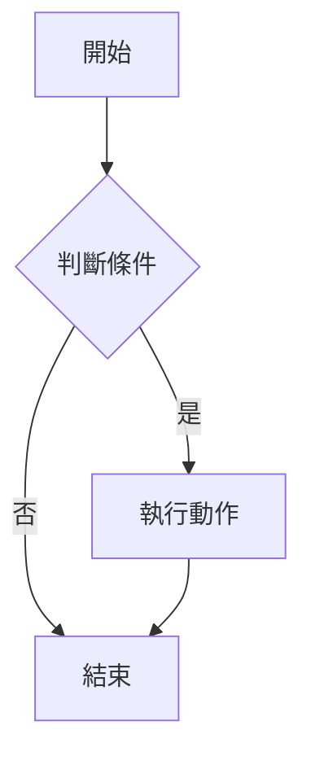

# 進階用法

## YAML Front Matter（選用）

MkDocs 支援在 Markdown 檔案頂部加入 YAML 設定：

```yaml
---
title: 自訂頁面標題
description: 這個頁面的描述（用於 SEO）
tags:
  - 教學
  - GitHub
---
```

## 進階 Markdown 語法

### 提示框（Admonitions）

```markdown
!!! note "注意事項"
    這是一個注意提示框。

!!! warning "警告"
    這是一個警告提示框。

!!! tip "小提示"
    這是一個提示框。
```

效果展示：

!!! note "注意事項"
    這是一個注意提示框。

!!! warning "警告"
    這是一個警告提示框。

!!! tip "小提示"
    這是一個提示框。

### 程式碼區塊（含語法高亮）

````markdown
```python title="hello.py" linenums="1"
def greet(name: str) -> str:
    """打招呼函式"""
    return f"你好，{name}！"

print(greet("世界"))
```
````

效果展示：

```python title="hello.py" linenums="1"
def greet(name: str) -> str:
    """打招呼函式"""
    return f"你好，{name}！"

print(greet("世界"))
```

### 分頁標籤

```markdown
=== "Python"

    ```python
    print("Hello World")
    ```

=== "JavaScript"

    ```javascript
    console.log("Hello World");
    ```
```

=== "Python"

    ```python
    print("Hello World")
    ```

=== "JavaScript"

    ```javascript
    console.log("Hello World");
    ```

### 表格

```markdown
| 功能 | 語法 | 說明 |
|:-----|:----:|-----:|
| 粗體 | `**text**` | 左對齊 |
| 斜體 | `*text*` | 置中 |
| 連結 | `[text](url)` | 右對齊 |
```

| 功能 | 語法 | 說明 |
|:-----|:----:|-----:|
| 粗體 | `**text**` | 左對齊 |
| 斜體 | `*text*` | 置中 |
| 連結 | `[text](url)` | 右對齊 |

### Mermaid 圖表

````markdown

````


## 自訂主題設定

在 `mkdocs.yml` 中可以調整更多設定：

```yaml
theme:
  name: material
  features:
    - navigation.tabs       # 頂部分頁
    - navigation.sections   # 側邊欄分組
    - navigation.expand     # 自動展開
    - search.suggest        # 搜尋建議
    - content.code.copy     # 程式碼複製按鈕
  palette:
    primary: deep purple    # 主色調
    accent: amber           # 強調色
```

## 常用外掛

```yaml
plugins:
  - search                  # 全文搜尋
  - tags                    # 標籤系統
  - git-revision-date       # 顯示最後修改日期
```
