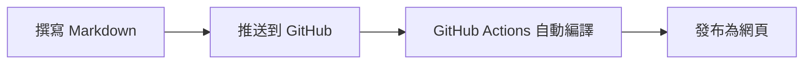

# 歡迎來到TNKuo學習筆記

這是一個使用 **MkDocs + GitHub Pages** 建立的靜態網站。

## 這個網站包含什麼？

- 🚀 [快速開始](getting-started.md) — 如何建立你自己的 GitHub Pages
- 📚 [進階用法](advanced.md) — YAML front matter 與進階 Markdown 語法

## 如何運作？

!!! tip "小提示"
    每次你推送程式碼到 `main` 分支，網站就會自動更新！

## 快速連結

| 資源 | 說明 |
|------|------|
| [MkDocs 文件](https://www.mkdocs.org) | 官方文件 |
| [Material 主題](https://squidfunk.github.io/mkdocs-material/) | 本站使用的主題 |
| [Markdown 語法](https://www.markdownguide.org/) | Markdown 完整指南 |
| [YML教學1](https://www.youtube.com/watch?v=DeZjkCtttss&t=381s) | YML 建立教學 |
| [YML教學2](https://www.youtube.com/watch?v=xlABhbnNrfI) | YML 建立教學 |